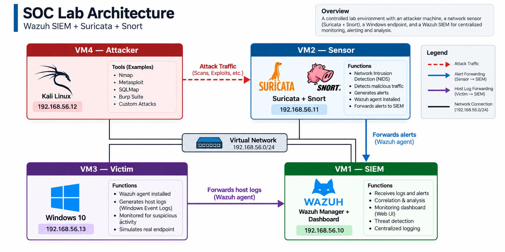

# 🛡️ SOC Lab — Wazuh SIEM + Suricata + Snort

A self-contained Security Operations Center (SOC) lab built on 4 virtual machines, combining a SIEM (Wazuh), network intrusion detection (Suricata + Snort), a monitored Windows endpoint, and an attacker machine for live threat simulation.

## 📑 Table of Contents
- [Overview](#overview)
- [Architecture](#architecture)
- [Prerequisites](#prerequisites)
- [Setup Steps](#setup-steps)
- [Attack Simulations](#attack-simulations)
- [Custom Detection Rules](#custom-detection-rules)
- [Screenshots](#screenshots)
- [Troubleshooting](#troubleshooting)
- [License](#license)

## 🔎 Overview

This project demonstrates:
- ✅ Centralized log collection via Wazuh SIEM
- ✅ Real-time network intrusion detection via Suricata + Snort
- ✅ Host-based monitoring on Windows 10
- ✅ Live attack simulation from Kali Linux
- ✅ Custom detection rule for Nmap scans (MITRE T1046)

## 🏗️ Architecture

| VM | Role | OS | IP |
|----|------|----|----|
| VM1 | SIEM | Ubuntu Server 22.04 | 192.168.56.10 |
| VM2 | Sensor (IDS) | Ubuntu Server 22.04 | 192.168.56.11 |
| VM3 | Victim | Windows 10 | 192.168.56.13 |
| VM4 | Attacker | Kali Linux | 192.168.56.12 |

## 🚀 Setup Steps

See [docs/SETUP.md](docs/SETUP.md) for the complete setup guide.

## ⚔️ Attack Simulations

See [docs/ATTACKS.md](docs/ATTACKS.md) for detailed attack procedures and expected results.

## 🎯 Custom Detection Rules

Custom rule for Nmap detection (MITRE T1046):

See [configs/local_rules.xml](configs/local_rules.xml).

## 📸 Screenshots

See the [screenshots/](screenshots/) folder for step-by-step visual evidence of the setup and attacks.

## 🧩 Troubleshooting

See [docs/TROUBLESHOOTING.md](docs/TROUBLESHOOTING.md).

## 📜 License

This project is intended for educational and lab use only. Do not run attack tools against systems you do not own or have explicit permission to test.
